<h3><code>jachym@arch ~ $ ./contributions.sh</code></h3>

  

<h3><code>jachym@arch ~ $ whoami</code></h3>
<table width="100%">
  <tr>
    <td width="43%" valign="top"></td>
    <td width="57%" valign="top"></td>
  </tr>
</table>

 

<h3><code>jachym@arch ~ $ ls ~/links</code></h3>

<a href="https://jachym.djt-group.com"><code>portfolio/</code></a>&nbsp;&nbsp;
<a href="https://github.com/OckoTajny/dotfiles"><code>dotfiles/</code></a>&nbsp;&nbsp;
<a href="https://www.linkedin.com/in/OckoTajny"><code>linkedin/</code></a>&nbsp;&nbsp;
<a href="https://djt-group.com"><code>djt-group/</code></a>

